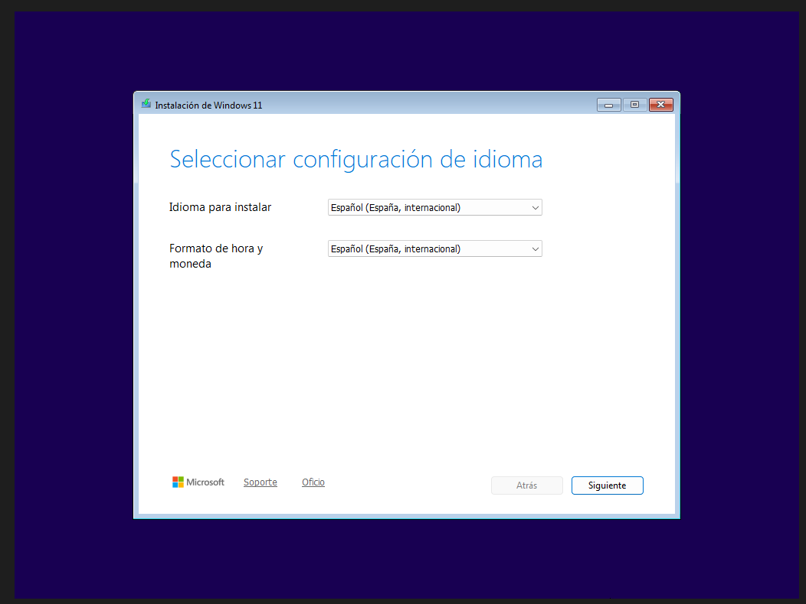

# INSTALACION DEL SISTEMA OPERATIVO WINDOWS 11

vamos a hacer una de las cosas mas basicas en el mundillo de la informatica y ademas de ser algo bastante sencillote te ahorraras como poco 50€ 
y esto como todo en la vida es algo que tu tecnico de confianza no quiere que sepas.

ojo para esto necesitaras un usb con ventoy y una imagen iso dentro o haber echo un usb boteable con la herramienta oficial de microsoft o con rufus

ademas de hacer la instalacion propiamente dicha os enseñare el truquiviri que ademas el tecnico ni siquiera sabe para instalar el sistema con una cuenta local y no tener el follon de la cuenta de microsoft, en este caso este metodo es microsoft el que no quiere que lo sepas... DE NADA.

  

---

esta es la pantalla del instalador de windows, como vemos es bastante simple lo que haremos es elegir el idioma en mi caso español de españa para el idioma y el formato de hora y moneda pero tu puedes elegir el que mejor te apañe 

