<div align="center">

# 🪟 Instalación Limpia de Windows 11 y Configuración con Cuenta Local

Guía paso a paso para realizar una instalación desde cero de Windows 11, omitiendo la vinculación obligatoria de una cuenta de Microsoft.

| Dificultad | Tiempo estimado | Requisitos |
| :---: | :---: | :---: |
| 🟢 Principiante | 20 - 30 min | Pendrive USB booteable (Ventoy, Rufus o Media Creation Tool) |

</div>

---

> [!IMPORTANT]
> **Requisito previo:** Necesitarás un pendrive USB booteable configurado previamente con la imagen ISO de Windows 11.

---

## 1. Configuración de idioma y región

En la pantalla inicial del instalador, selecciona el idioma del sistema, la distribución de teclado inicial y el formato de hora o moneda correspondiente a tu región. Pulsa en **Siguiente** para continuar.

<div align="center">
  
</div>

A continuación, confirma la distribución de teclado requerida.

<div align="center">
  
</div>

---

## 2. Tipo de instalación y advertencia de respaldo

En la pantalla de selección de opciones:
1. Dirígete al apartado **"Me gustaría"** y selecciona **Instalar Windows**.
2. Marca la casilla de verificación: *"Acepto que se elimine todo, incluidos los archivos, las aplicaciones y la configuración"*.

> [!WARNING]
> **Copia de seguridad requerida:** Formatear el equipo eliminará permanentemente todos los datos guardados en el disco. Si no has realizado un respaldo previo de tus archivos personales, cancela la instalación, guarda tu información en una unidad externa y reinicia el proceso.

<div align="center">
  
</div>

---

## 3. Clave de producto y elección de versión

Si dispones de una clave de producto, introdúcela en el campo correspondiente. Si no posees una clave en este momento, selecciona la opción **"No tengo clave de licencia"** para realizar la activación posteriormente.

<div align="center">
  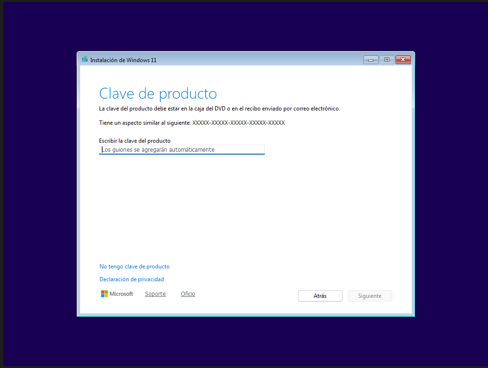
</div>

### Selección de edición:
* **Windows 11 Home:** Diseñada para uso doméstico estándar. Incluye mayor recopilación de telemetría por defecto y carece de ciertas herramientas de gestión avanzada.
* **Windows 11 Pro:** Incluye herramientas corporativas y de seguridad (como BitLocker o la directiva de grupo local) y facilita la omisión del requisito de cuenta Microsoft.

En este tutorial seleccionaremos **Windows 11 Pro** y pulsaremos en **Siguiente**.

<div align="center">
  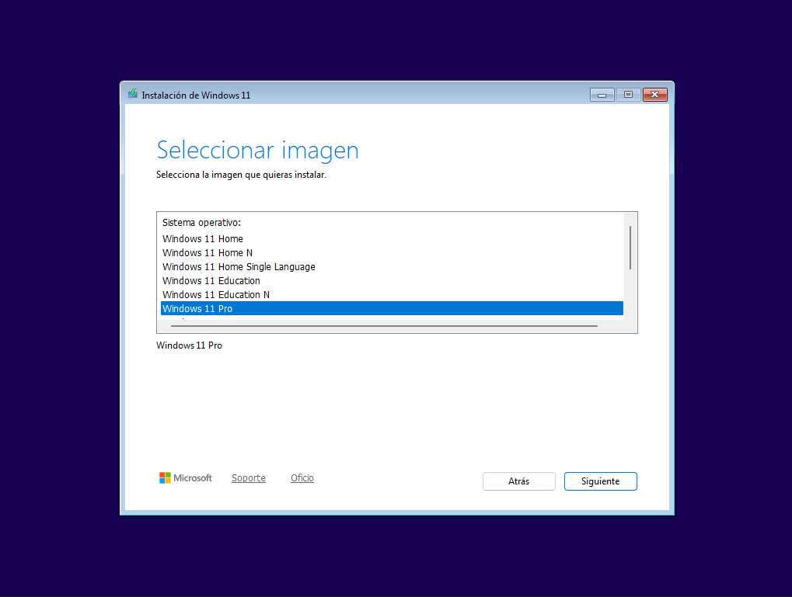
</div>

Acepta los términos de la licencia para continuar con el proceso.

<div align="center">
  
</div>

---

## 4. Gestión de particiones y disco duro

En esta sección administrarás las unidades de almacenamiento:

* **Instalación en disco vacío:** Selecciona la unidad con "Espacio no asignado" y haz clic en **Siguiente**.
* **Reinstalación / Formateo completo:** Si el disco contiene particiones previas (generalmente una de Sistema EFI, otra de Recuperación y la partición principal C:), selecciona cada una de ellas y haz clic en **Eliminar** hasta dejar únicamente la unidad con espacio no asignado.

<div align="center">
  
</div>

Confirma haciendo clic en **Instalar**.

<div align="center">
  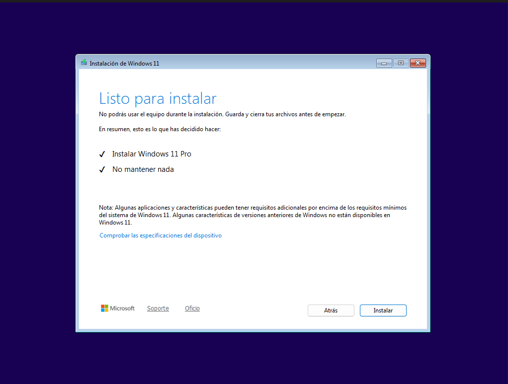
</div>

El sistema copiará los archivos de instalación de forma automática. Al finalizar la barra de progreso, el equipo se reiniciará.

<div align="center">
  
</div>

---

## 5. Saltear el requisito de Cuenta Microsoft (Bypass OOBE)

Una vez completado el reinicio, el sistema mostrará la pantalla inicial de configuración regional (OOBE).

<div align="center">
  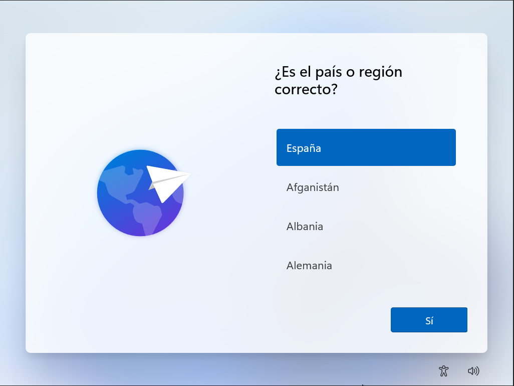
</div>

Para habilitar la creación de una cuenta local sin conexión a internet:

1. Presiona la combinación de teclas **Shift + F10** (o `Shift + Fn + F10` en ordenadores portátiles) para abrir la consola de comandos (CMD).
2. Escribe exactamente el siguiente comando y pulsa **Enter**:

```cmd
oobe\bypassnro
```
3. presiona enter y espera a que se reinicie el pc

---

## 6. configuracion inicial de sistema (ahora ya esta activada la opcion de cuenta local)

1. elegimos el pais o region

<div align=center>
  
</div>

2. elegimos la distribucion del teclado

<div align=center>
  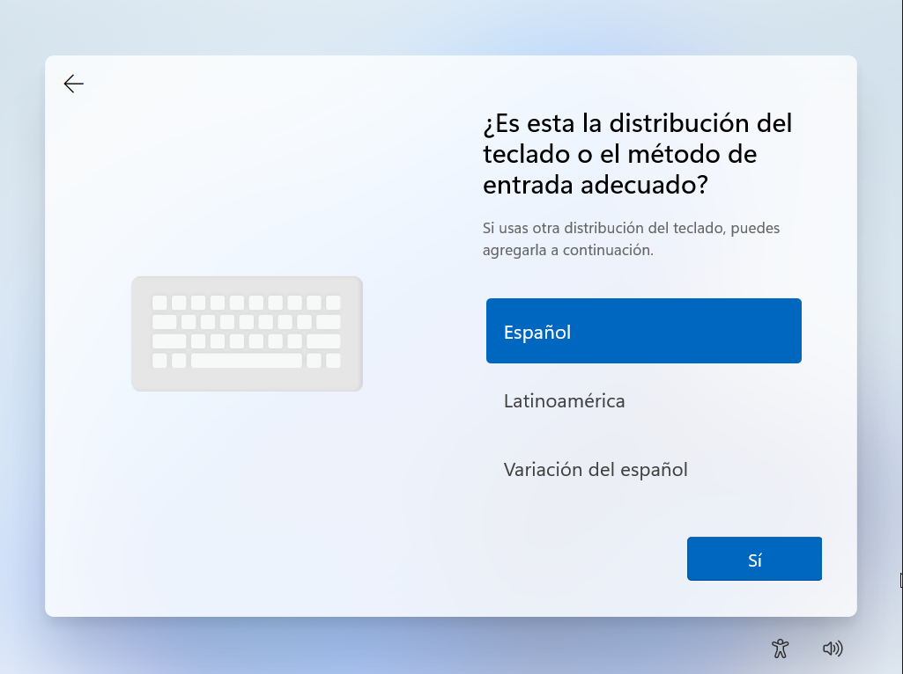
</div>

3. omitimos el agregar una segunda distribucion

<div align=center>
  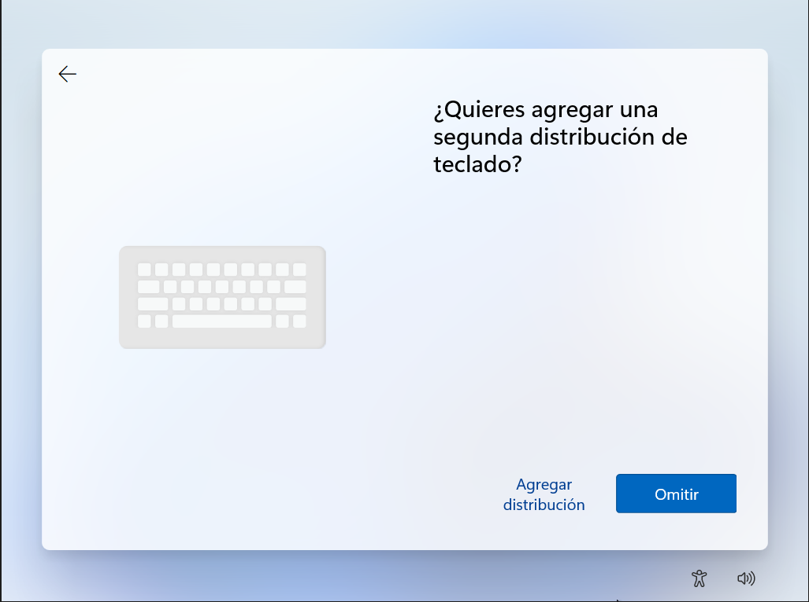
</div>

4. en conectarte a una red le4 daremos a no tengo internet

<div align=center>
  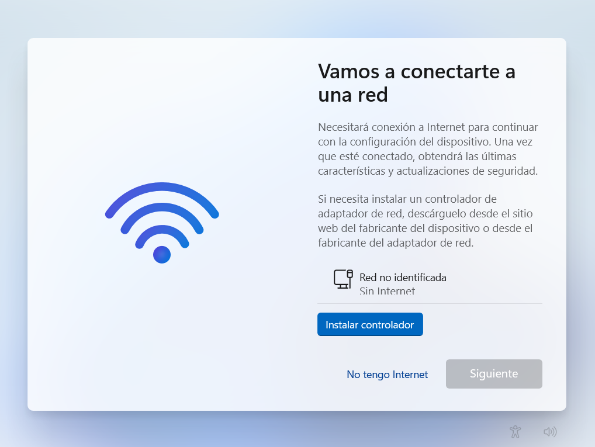
</div>

5. aqui ponemos nuestro nombre de usuario

<div align=center>
  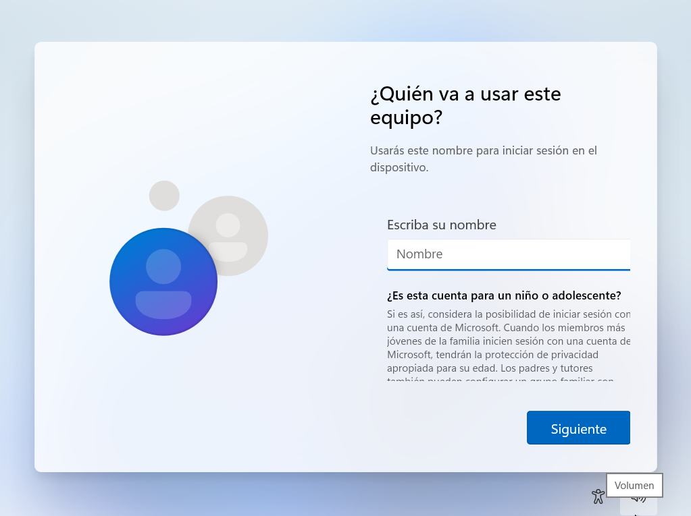
</div>

6. aqui escribimos la contraseña en caso de que queramos ponerle una, en caso de que no sea el caso pulsamos enter y el sistema iniciara sesion automaticamente

<div align=center>
  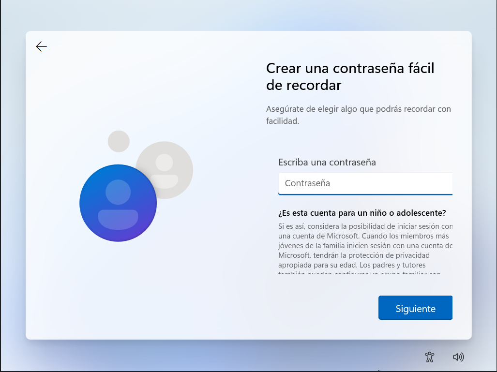
</div>

7. aqui marca lo que he marcado yo

<div align=center>
  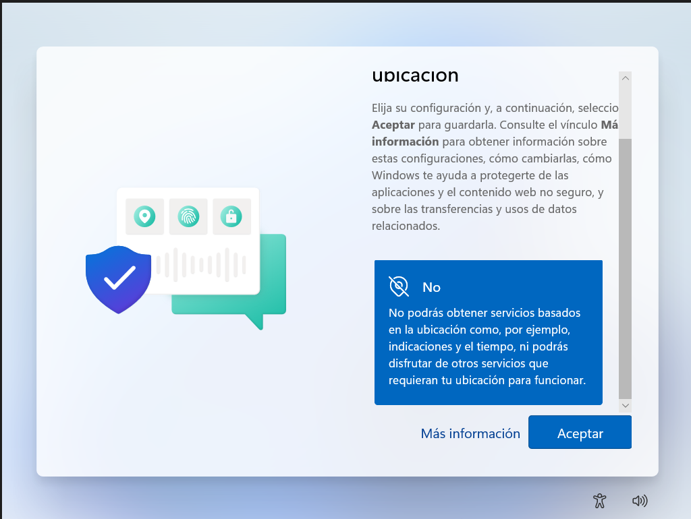
  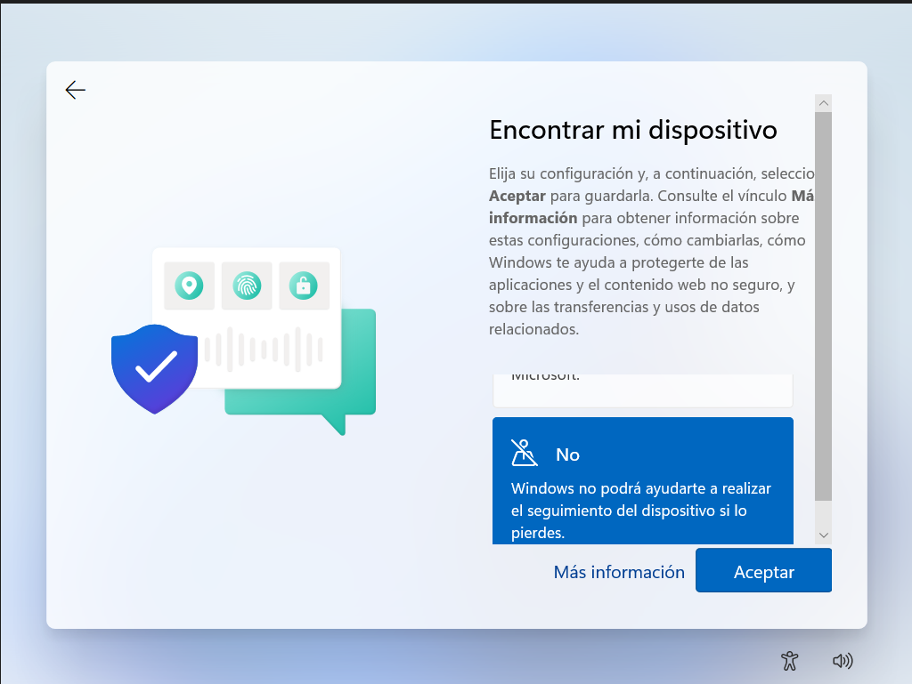
  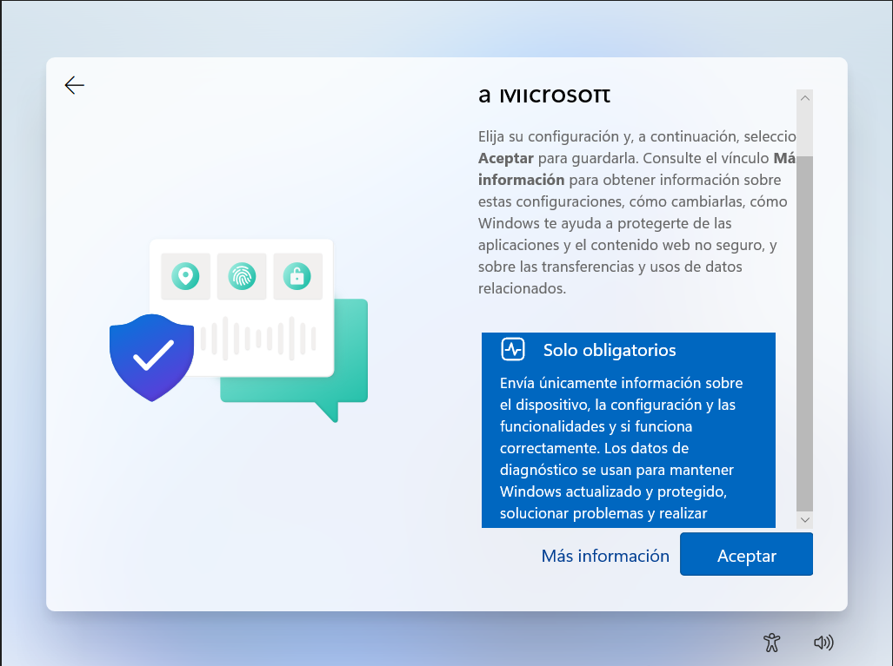
  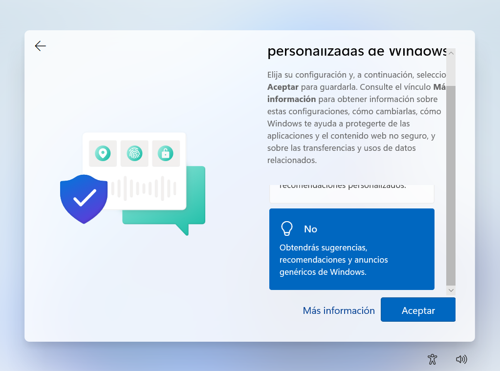
</div>

8. luego aparecera esta pantalla espera unos momentos a que termine de instalar lo que le queda

<div align=center>
  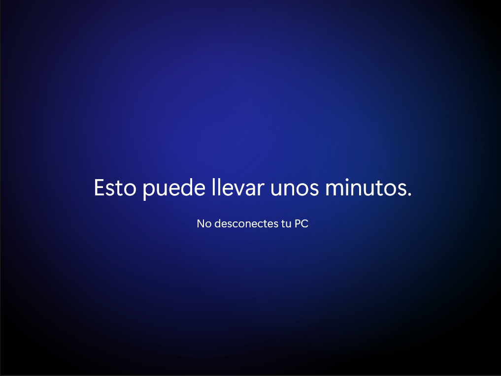
</div>

despues de esta pantallita el sistema pasa a un fundido a negro y tatachan windows esta instalado con exito, ahora si dale conexion a internet, ve a windows update y ponlo a actualizar para ponerlo al dia

