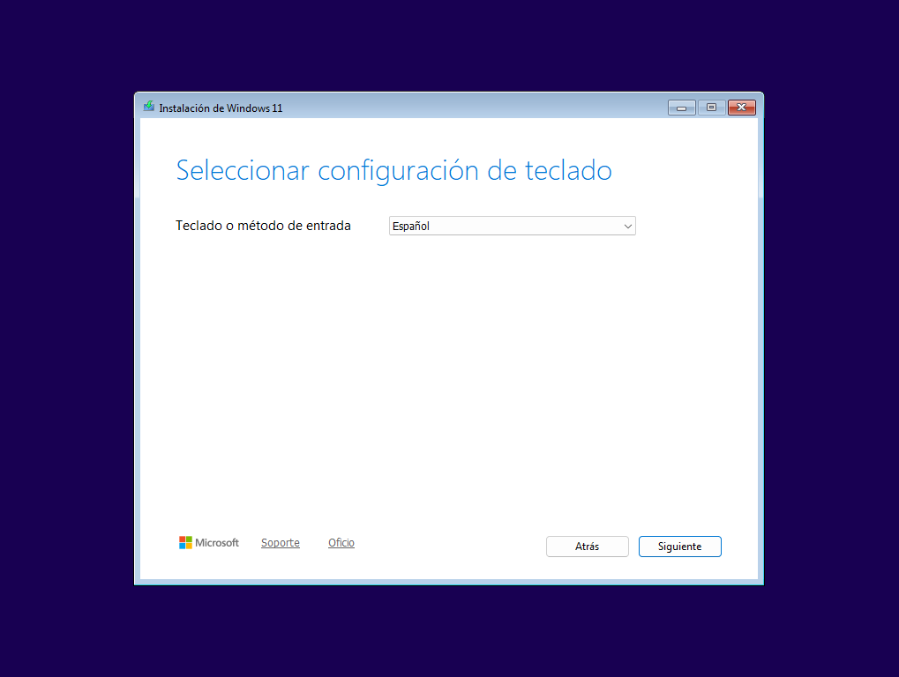
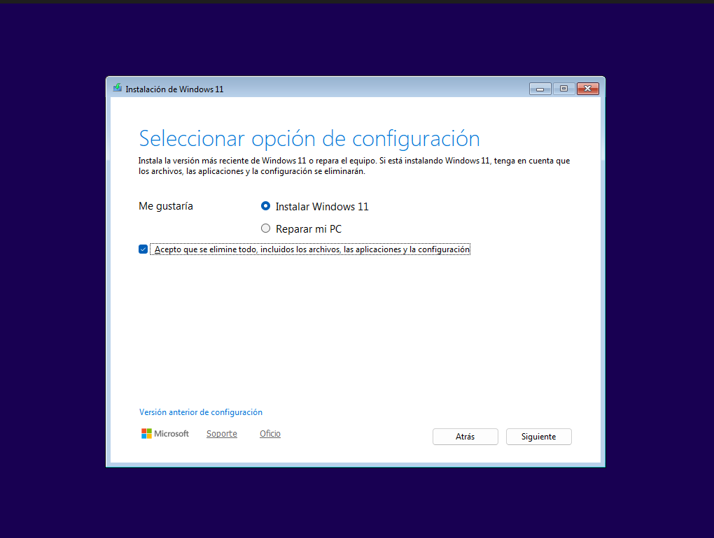
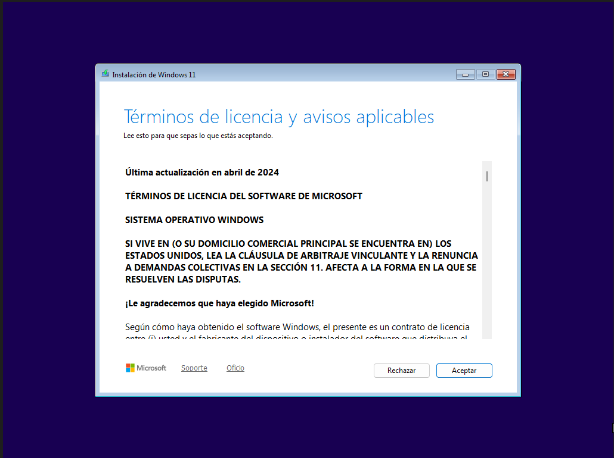
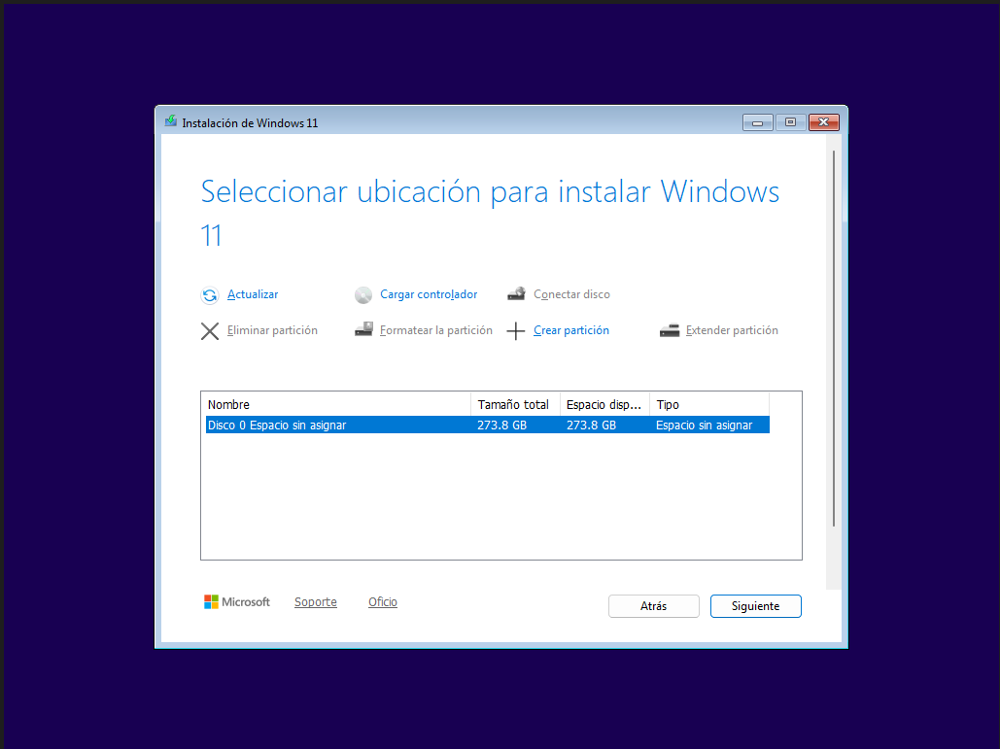
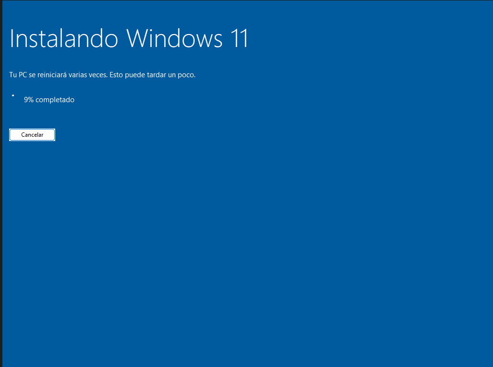
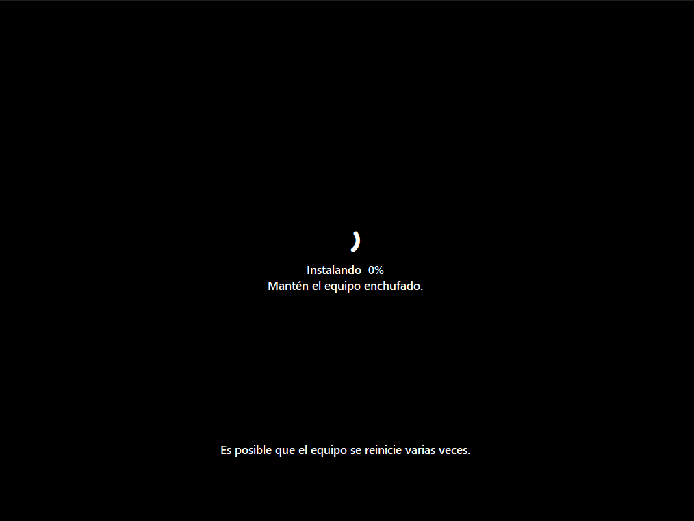

# INSTALACION DEL SISTEMA OPERATIVO WINDOWS 11

vamos a hacer una de las cosas mas basicas en el mundillo de la informatica y ademas de ser algo bastante sencillote te ahorraras como poco 50€ 
y esto como todo en la vida es algo que tu tecnico de confianza no quiere que sepas.

ojo para esto necesitaras un usb con ventoy y una imagen iso dentro o haber echo un usb boteable con la herramienta oficial de microsoft o con rufus

ademas de hacer la instalacion propiamente dicha os enseñare el truquiviri que ademas el tecnico ni siquiera sabe para instalar el sistema con una cuenta local y no tener el follon de la cuenta de microsoft, en este caso este metodo es microsoft el que no quiere que lo sepas... DE NADA.

  

---

esta es la pantalla del instalador de windows, como vemos es bastante simple lo que haremos es elegir el idioma en mi caso español de españa para el idioma y el formato de hora y moneda pero tu puedes elegir el que mejor te apañe y pulsamos siguiente

  

ahora toca configurar el teclado como yo he elegido el idioma español lo dejo como se muestra en la imagen pero tu puedes elegir el que quieras y pulsamos siguiente

  

ahora en esta pantalla de seleccionar opciones de configuracion vamos al apartado de "me gustaria" y marcamos la opcion de instalar windows y marcamos el check de "acepto que se elimine todo incluido los archivos las aplicaciones  y la configuracion" antes de continuar recuerda haber echo una copia de seguridad de tus archivos ya que formatear el pc hace que se pierda todo y si es la primera vez que instalas windows por que el ordenata es nuevo dale siguiente sin problema, en caso de no ser asi y no tengas la copia de seguridad echa reinicia el pc guarda tus archivos en un lugar seguro y empieza de nuevo la instalacion y si te la pela por que no le tienes miedo al exito dale siguiente sin miedo

  

llegamos al apartado de clave de producto, hoy en dia hacerse con una clave de producto es bastante sencillo y economico, si ya tienes una clave es el momento de escribirla en el campo correspondiente (el unico que hay) y le dariams siguiente nuevamente

en caso de no disponer de clave de licencia todavia no te preocupes microsoft es tan amable que te deja instalar su sistema de todas maneras en mi caso al estar instalando windows en una maquina virtual elegire la opcion de "no tengo clave de licencia" y si tu tampoco tienes clave selecciona esta opcion conmigo 

  

los que se hallais venido conmigo a este paso os dare un pequeño consejo hay muchas versiones de windows, cada una con un proposito pero en esencia es el mismo perro con diferente collar, por lo que nos fijaremos unica y exclusivamente en dos versiones de windows la home y la pro y os explico las diferencias entre ambas

* **WINDOWS 11 HOME**

  esta version del sistema operativo esta diseñada para el comun de los mortales lo tiene todo para el 95% de los mortales, pero eso si tiene algunas desventajas, si ya de por si windows te trata como un usuario de segunda, la version home te trata como a un usuario casi de tercera, ademas esta version tiene mas telemetria que la version pro y ademas de eso esta capado en cuanto a funciones y configuraciones del sistema operativo, ¿es entonces una mala opcion? para nada como he dicho antes esta version es ideal para el 95% de los mortales de echo creo que en esta version el bypass para hacer la instalacion del sistema de manera local ya no funciona

* **WINDOWS 11 PRO**

esta es la joyita de la corona de microsoft (aunque la verdadera joya es microsoft ioT ltsc enterprice pero esa version se obtiene por otras vias) la version pro se caracteriza por tener mas opciones avanzadas del sistema, mas caracteristicas pero a la vez por un consumo mayor de recursos del sistema en esta version el bypass para instalar el sistema con la cuenta local si funciona, asi que en mi caso particular elegire la version pro (ademas era la que tenia an mi pc antes de pasarme a ubuntu) y pulsamos siguiente nuevamente

  

aceptamos los terminos de licencia 

  

ahora si, ya estamos en la manteca de la instalacion del sistema, como yo solo tengo un disco duro en mi maquina virtual y encima vacio no tengo ningun problema en seleccionarlo y darle siguiente en caso de que tengas particiones y mas discos, eso ya entraria dentro de la instalacion avanzada del sistema operativo pero es bastante simple de explicar si quieres formatear el pc en vez de hacer una instalacion nueva como es mi caso, windows diferencia los discos de la siguiente manera en caso de que tengas varios (disco 1, disco 2 disco 3) el truco esta en borrar las particiones correspondiantes a cada disco y no hay fallo normalmente windows crea tres particiones al instalarse una de sistema efi otro de recuperacion de un giga aproximadamente y otra del disco "C"que es la mas grande de todas, esas tres particiones en el caso de que te aparezcan hay que seleccionarlas y darle a la opcion eliminar y ahora si damos en siguiente

  

en esta pantalla pulsamos en instalar

  

el sistema comenzar a instalarse asi que hay que dejarlo que hagas sus tejemanejes tranquilo

  
  

